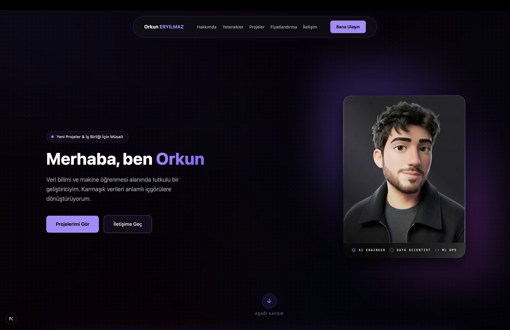

# Orkun Eryılmaz | Portfolio

Modern, interaktif ve şık bir veri bilimi & makine öğrenmesi portfolyosu. Bu proje, projelerimi sergilemek, hizmetlerimi sunmak ve iletişim kanallarını tek bir platformda toplamak amacıyla Next.js ile geliştirilmiştir.



## 🚀 Özellikler

-   **İnteraktif Proje Kartları:** Projeler arasında geçiş yapmayı sağlayan özel carousel bileşeni.
-   **İletişim Formu (Backend Entegrasyonlu):** Nodemailer ve Gmail API kullanılarak oluşturulmuş, gerçek e-posta gönderimi yapan iletişim formu.
-   **Dinamik Arka Plan:** Fare hareketlerine duyarlı interaktif grid sistemi ve aurora efektleri.
-   **Hizmet Paketleri ve Fiyatlandırma:** Güncel hizmet paketleri ve iletişim formuna yönlendiren butonlar.
-   **Mobil Uyumlu Tasarım:** Tüm cihazlarda kusursuz görünen responsive arayüz.
-   **Terminal Arayüzü:** Hakkımda bilgileri için nostaljik terminal görünümü.

## 🛠️ Teknoloji Yığını

-   **Framework:** [Next.js 15 (App Router)](https://nextjs.org/)
-   **Dil:** [TypeScript](https://www.typescriptlang.org/)
-   **Styling:** Vanilla CSS
-   **Backend/Mail:** [Nodemailer](https://nodemailer.com/)

## 📦 Kurulum

Projeyi yerelinizde çalıştırmak için:

1.  **Depoyu klayonlayın:**
    ```bash
    git clone https://github.com/orkunerylmz/Portfolio.git
    cd Portfolio
    ```

2.  **Bağımlılıkları yükleyin:**
    ```bash
    npm install
    ```

3.  **.env.local dosyasını oluşturun:**
    ```env
    EMAIL_USER=your-email@gmail.com
    EMAIL_PASS=your-gmail-app-password
    ```

4.  **Çalıştırın:**
    ```bash
    npm run dev
    ```

## 📧 İletişim

-   **Email:** [orkunerylmz@gmail.com](mailto:orkunerylmz@gmail.com)
-   **GitHub:** [@orkunerylmz](https://github.com/orkunerylmz)
-   **Instagram:** [@orkunerylmz](https://instagram.com/orkunerylmz)

---
*Bu proje Orkun Eryılmaz tarafından geliştirilmiştir.*
